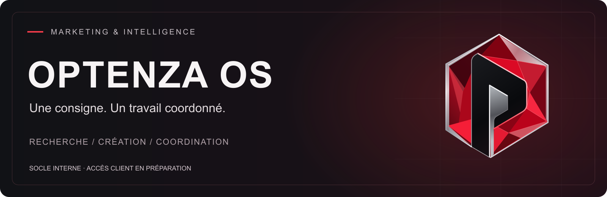

<h1 align="center">Optenza</h1>

<strong>35 profils métiers · 6 familles · Une coordination humaine</strong>

<a href="https://optenza.ca">Site Optenza</a> · <a href="https://optenza.ca/optenza-os/">Explorer le produit</a> · <a href="https://optenza.ca/feuille-de-route/">Feuille de route</a> · <a href="https://optenza.ca/contact/">Contact</a>

---

## Ce que je construis

Je développe **Optenza OS**, un espace de travail pour relier la recherche, les dossiers, la création et les prochaines actions. L’objectif : donner une direction commune aux outils et aux agents IA, en conservant le contexte et les décisions dans le même projet.

**Optenza**, c’est aussi une offre de services : stratégie marketing, publicité, identité visuelle, présence Web, contenu et marketing de recrutement.

> **Votre entreprise. Toute sa force.** Des services pour vos projets aujourd’hui, et un socle logiciel qui se construit en parallèle.

## Une mission, du brief au livrable

**Exemple :** préparer une rencontre client, relire son dossier, relever les informations manquantes et proposer les prochaines étapes.

| Étape | Travail préparé |
|:--|:--|
| **01 · Cadrer** | Préciser l’objectif, le contexte et le résultat attendu avec Laurence. |
| **02 · Coordonner** | Mobiliser les expertises utiles autour d’un brief commun. |
| **03 · Examiner** | Réunir les sources, constats, brouillons et questions ouvertes. |
| **04 · Valider** | Faire approuver le périmètre, le contenu et les actions externes par la personne désignée. |
| **05 · Livrer et suivre** | Vérifier le résultat, conserver les versions et rendre la prochaine action visible. |

Le dossier accompagne le travail : **brief → sources → propositions → décisions → livrables**.

## Laurence et les six familles d’agents

**Laurence Gagnon** est le profil logiciel de coordination des opérations, appuyé par Hermes Agent. Elle est distincte des **35 profils métiers** présentés par Optenza. Ces agents logiciels ont des rôles et des procédures définis ; ce ne sont pas des employés ni 35 modèles entraînés séparément.

| Famille | Rôles | Contribution |
|:--|:--:|:--|
| **Gouvernance & orchestration** | 5 | Cadrage, budgets, propositions et décisions. |
| **Intelligence** | 8 | Recherche de marché, vérification des faits et interprétation des preuves. |
| **Croissance** | 9 | Positionnement, messages et plans d’acquisition. |
| **Création** | 8 | Identité, visuels, textes et concepts vidéo. |
| **Production** | 2 | Préparation des médias et suivi de production. |
| **Assurance** | 3 | Relecture de la qualité, de la conformité et des exigences publicitaires. |

[Explorer les rôles et leurs responsabilités →](https://optenza.ca/optenza-os/#agents)

## Les espaces du produit

| Espace | À quoi il sert |
|:--|:--|
| **Recherche et dossiers** | Rassembler le contexte, les documents autorisés et les constats. |
| **Missions et coordination** | Relier une demande au dossier et aux compétences utiles. |
| **Studio** | Préparer les propositions créatives et leur relecture. |
| **Atelier interne** | Préparer les consignes, travailler dans jusqu’à quatre consoles séparées et comparer les changements. |
| **Suivi** | Garder les versions, les décisions et la prochaine action ensemble. |

## Les outils derrière les rôles

**Claude · Codex · Gemini · Hermes** apportent des capacités complémentaires : analyse, recherche, travail structuré, création et coordination. Leur utilisation dépend de la mission et des outils effectivement configurés.

L’Atelier permet de choisir parmi les outils installés, notamment **Claude Code, Codex, Gemini CLI et Hermes local**, dans un environnement Ubuntu. Chaque outil conserve son compte et ses permissions.

## Où en est Optenza OS ?

| Volet | État présenté publiquement |
|:--|:--|
| **Recherche, dossiers, missions, Studio et Atelier** | Socle utilisé en interne ; produit en développement. |
| **Accès client** | En préparation ; pas encore ouvert. |
| **Courriels, réunions et calendriers** | Raccordements et développements à poursuivre. |
| **Prise d’appels assistée** | Prévue dans la trajectoire du produit. |
| **Accès SaaS pour les équipes** | Prévu ; aucune date ferme de lancement annoncée. |

[Disponibilité des connexions](https://optenza.ca/optenza-os/#connexions) · [Feuille de route](https://optenza.ca/feuille-de-route/)

## Les principes de travail

- **Le contexte avant la production.** Partir du besoin réel et des documents autorisés.
- **Des faits traçables.** Conserver les sources et distinguer constats, hypothèses et propositions.
- **Une décision humaine.** Faire valider le contenu et les actions externes.
- **Un résultat vérifié.** Une tâche en file ou un brouillon ne vaut pas une livraison.

## Découvrir Optenza

[Services et expertises](https://optenza.ca/#expertises) · [Notre approche](https://optenza.ca/a-propos/) · [Identité et projet Optenza](https://optenza.ca/projet-optenza/)

**Un projet, une équipe ou un besoin à clarifier ?** [Parlons-en](https://optenza.ca/contact/) · [info@optenza.ca](mailto:info@optenza.ca)

Présentation fondée sur les informations publiques d’Optenza, consultées le 13 septembre 2026. Les états ci-dessus décrivent le produit et ne constituent pas une mesure de disponibilité en direct.
